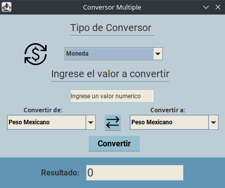

# Challenge-ConversorDeMoneda-BackEnd-ONE-G4
Conversor Multiple realizado en Java con Swing

Esta es mi propuesta para el challenge de alura "Conversor de Moneda" con Java usando Swing como GUI.

### Challenge

Los usuarios seran capaces de:

- Visualizar de manera estructurada los elementos del programa.
- Seleccionar el tipo de conversor que desean utilizar
- Ingresar un valor numerico y seleccion de que tipo de valor a que tipo de valor desean convertir.
- Presionar el boton de convertir y obtener el resultado de la conversion.

### Screenshot

### Video

## Contacto

- Twitter - [@Jonatha90564714](https://twitter.com/Jonatha90564714)
- LinkedIn - [LinkedIn](https://www.linkedin.com/in/jonathan-mauricio-cifuentes-bar%C3%B3n-1094b6b7/)
